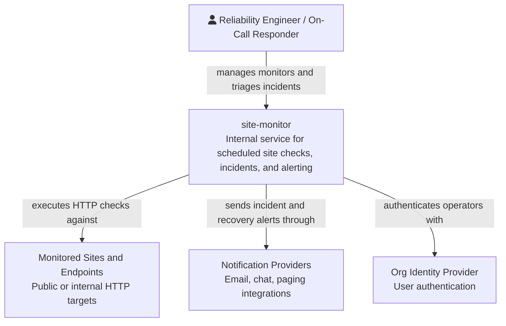
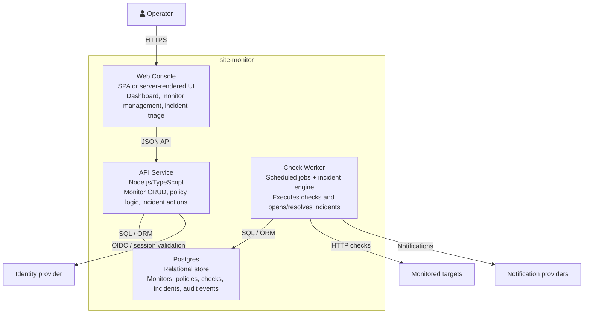
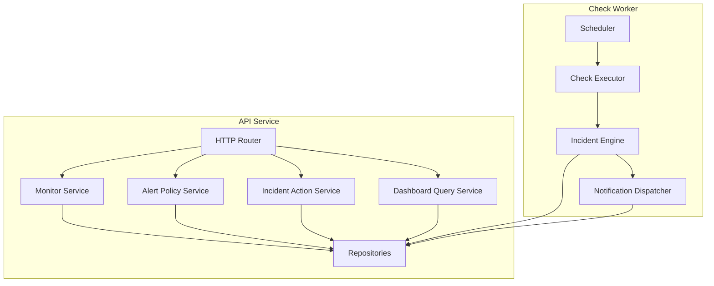

# C4 Architecture -- site-monitor

## Level 1: System Context

## Level 2: Container Diagram

## Level 3: Component Diagram

## Boundary Notes

- The web console is strictly an operator surface and should not own check execution logic.
- The worker is the system of record for monitor execution, threshold evaluation, and alert delivery side effects.
- Postgres is the shared persistence boundary for monitor definitions, check results, incident state, and audit history.
- Notification providers stay behind a dispatcher boundary so new channels do not leak provider-specific logic into the incident engine.
