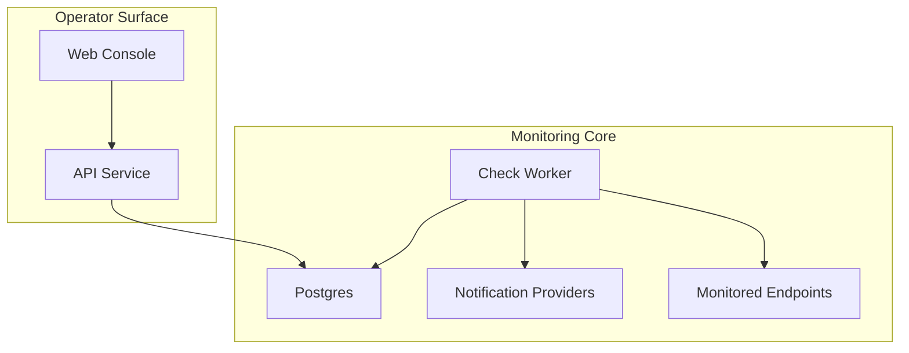

# Executive Brief -- site-monitor

> **Status:** Awaiting approval
> **Autonomy level:** Standard
> **Created:** 2026-04-06
> **Project type:** Internal reliability service
> **Project traits:** monitoring, incident management, alerting

## What We Think You Want

You want `site-monitor` defined as a focused internal product that can watch important sites and endpoints, open incidents when they fail, and give on-call users a usable console for action. Because the repo is effectively empty and the GitHub project board was not readable from this sandboxed session, this brief deliberately narrows scope to the smallest complete monitoring loop supported by the available intake signal.

## What We Will Build

- A monitor management surface for defining scheduled HTTP checks, thresholds, maintenance windows, and alert policies.
- A backend monitoring system that runs checks, stores results, groups failures into incidents, and delivers notifications.
- An operator dashboard and incident detail workflow for triage, acknowledgement, muting, and resolution.

## Key Screen Preview

  

    <b>site-monitor</b>
    Dashboard
  

  

    

      
Healthy

      
Degraded

      
Open incidents

      
Paused

    

    

      
Monitor table

      
Open incidents

    

  

## What We Will NOT Build

- Public status pages or customer-facing uptime communication in this phase.
- Browser automation, screenshot capture, or scripted synthetic journeys.
- Enterprise multi-tenancy, billing, or deep role hierarchy beyond basic authenticated operator access.

## Top Risks

| Risk | Impact | Mitigation |
|------|--------|-----------|
| Hidden scope exists in GitHub board `11` that was not readable here | Planning may omit or contradict approved work | Call out the board-access gap explicitly and require human review of this brief before implementation |
| The referenced worker prototype is not present in the current repo | Real implementation may diverge from this architecture or data model | Keep the architecture modular and treat implementation decomposition as provisional until code is visible |
| Poor threshold and alert policy defaults create alert fatigue | Operators lose trust in the system quickly | Make policy behavior explicit in the PRD and provide previewable thresholds and maintenance windows |

## Recommended Approach

Build the MVP as a small internal platform with a web console, an API service, and a separate check worker backed by Postgres. This keeps check execution and alert side effects isolated from operator-facing traffic, matches the intake signal that backend worker work already exists, and creates a clean path for later additions without over-scoping the first release.

## Estimated Scope

- **Issues:** ~8-10 after approval
- **Complexity:** Medium
- **Estimated time:** 1-2 weeks for MVP implementation from a clean repo

## Pre-Issue Implementation Decomposition

1. Monitor definitions and policy model: `REQ-001`, `REQ-002`, `NFR-005`
2. Check scheduler, executor, and incident engine: `REQ-003`, `REQ-004`, `NFR-001`, `NFR-002`
3. Notification dispatch and incident actions: `REQ-005`, `NFR-005`, `NFR-006`
4. Dashboard, monitor detail, and incident UX: `REQ-003`, `REQ-004`, `REQ-005`, `NFR-003`, `NFR-004`, `NFR-007`
5. Delivery pipeline and release hardening: `NFR-001`, `NFR-002`, `NFR-005`, `NFR-006`

## Detailed Docs

- [Research -- Knowledge Tree](../research/knowledge-tree.md)
- [Product Requirements (PRD)](../prd/project-prd.md)
- [UX Specification](../ux/ux-spec.md)
- [Architecture (C4)](../architecture/c4.md)
