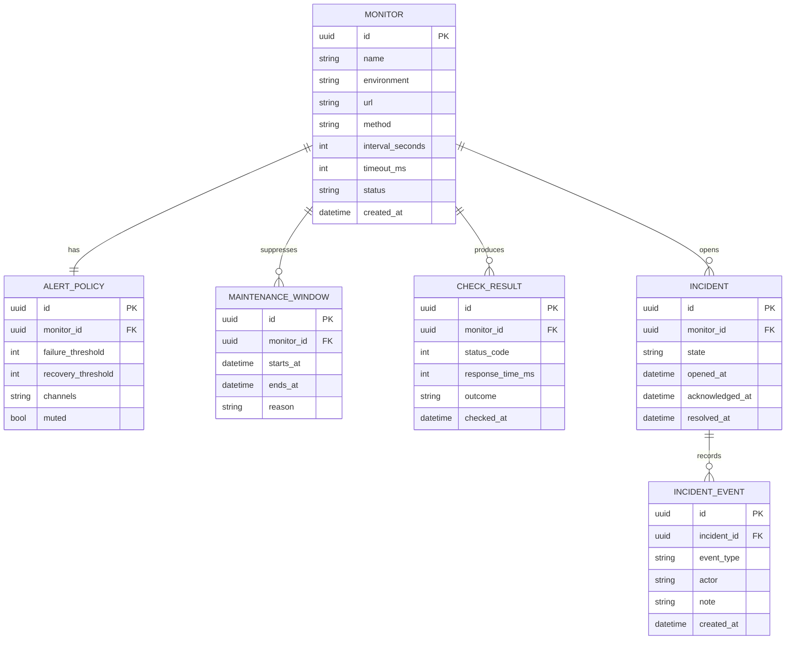

# Product Requirements -- site-monitor

## Overview

`site-monitor` is an internal site monitoring service for engineering and on-call teams that need to detect website and endpoint failures quickly, track incidents clearly, and notify responders through configured channels. The MVP will provide a web console for monitor management and incident review, plus a backend system that executes checks on a schedule, persists results, and triggers alerts.

## Goals

1. Detect availability and latency regressions for configured sites and endpoints with predictable, operator-friendly incident behavior.
2. Give on-call responders a single console to review current health, investigate failures, and acknowledge or resolve incidents.
3. Keep the initial scope narrow enough to ship from an otherwise empty repository without depending on undocumented prototype behavior.

## Non-Goals

- Public-facing status pages for external customers.
- Browser-driven synthetic journeys or screenshot-based checks in the MVP.
- Complex multi-tenant workspace management, billing, or fine-grained enterprise RBAC.

## User Stories

### Reliability Engineer

- **REQ-001** As a reliability engineer, I want to create and manage monitors so that important sites and endpoints are checked automatically.
  - Acceptance criteria:
    - [ ] I can create, edit, pause, resume, and archive a monitor with URL, method, interval, timeout, expected status range, and optional keyword match.
    - [ ] Invalid monitor inputs are rejected with field-level validation before the monitor is saved.
    - [ ] A paused or archived monitor is excluded from future scheduled checks.

- **REQ-002** As a reliability engineer, I want to configure alert policies and maintenance windows so that responders are notified only when failures are actionable.
  - Acceptance criteria:
    - [ ] I can define a failure threshold, recovery behavior, notification channel set, and escalation target for a monitor or monitor group.
    - [ ] I can create a maintenance window that suppresses alert delivery while still recording checks.
    - [ ] A policy preview shows whether a sample failure would notify operators or remain suppressed.

### On-Call Responder

- **REQ-003** As an on-call responder, I want a dashboard of current monitor status and open incidents so that I can see what needs attention immediately.
  - Acceptance criteria:
    - [ ] The dashboard shows counts for healthy, degraded, paused, and incident monitors.
    - [ ] I can filter the monitor list by environment, status, tag, and recent incident state.
    - [ ] The dashboard highlights open incidents and links directly to incident detail.

- **REQ-004** As an on-call responder, I want an incident timeline with failure evidence so that I can triage without searching raw logs elsewhere.
  - Acceptance criteria:
    - [ ] An incident detail view shows incident status, affected monitor, first failure time, latest check outcomes, and delivery history.
    - [ ] I can inspect the underlying check results for status code, response time, error class, and matching rule result.
    - [ ] The timeline distinguishes between failure onset, acknowledgements, recoveries, and manual resolution actions.

- **REQ-005** As an on-call responder, I want to acknowledge, mute, and resolve incidents so that the team has clear operational ownership during an outage.
  - Acceptance criteria:
    - [ ] I can acknowledge an incident with an optional note and the UI records who performed the action and when.
    - [ ] I can mute or unmute alert delivery for an active incident without deleting the monitor or policy.
    - [ ] A recovered monitor can auto-resolve an incident when policy conditions are met, while still allowing manual resolution when needed.

## Non-Functional Requirements

| ID | Requirement | Target | How to Verify |
|----|-------------|--------|---------------|
| NFR-001 | Detection latency | A monitor running every 60 seconds opens an incident within 90 seconds of threshold breach | Time-stamped integration test with scheduled worker run |
| NFR-002 | Check execution reliability | >= 99% of scheduled checks complete in staging over a 7-day soak | Worker metrics and staging audit |
| NFR-003 | Dashboard load time | Primary dashboard content renders in < 3 seconds on throttled 3G for a 30-day dataset slice | Lighthouse and browser profiling |
| NFR-004 | Accessibility | WCAG 2.2 AA for dashboard, monitor detail, and incident detail flows | Automated accessibility scan plus keyboard QA |
| NFR-005 | Secret handling | Monitor auth secrets and notification credentials are encrypted at rest and never shown in plaintext after creation | Security review plus integration tests |
| NFR-006 | Auditability | Incident actions and policy changes are retained for at least 90 days | Database retention test and API verification |
| NFR-007 | Mobile support | Core dashboard and incident triage flows remain usable at 375px width and above | Responsive visual QA across target viewports |

## Data Model

## API Contracts

### Monitor Management

- **Method:** `POST`
- **Path:** `/api/monitors`
- **Auth:** Required
- **Contract:** Creates a monitor with scheduling, matching, tagging, and policy references.

- **Method:** `PATCH`
- **Path:** `/api/monitors/:monitorId`
- **Auth:** Required
- **Contract:** Updates mutable monitor fields, including pause and resume actions.

### Dashboard and Incident Read APIs

- **Method:** `GET`
- **Path:** `/api/dashboard`
- **Auth:** Required
- **Contract:** Returns status summary counts, filtered monitor rows, and open incident previews.

- **Method:** `GET`
- **Path:** `/api/incidents/:incidentId`
- **Auth:** Required
- **Contract:** Returns incident metadata, recent check results, event timeline, and notification delivery state.

### Incident Actions

- **Method:** `POST`
- **Path:** `/api/incidents/:incidentId/actions`
- **Auth:** Required
- **Contract:** Applies acknowledge, mute, unmute, or resolve actions with operator note and actor metadata.

## Planned Delivery Slices

1. Monitor model and CRUD surfaces: `REQ-001`, `NFR-005`
2. Alert policy and maintenance logic: `REQ-002`, `REQ-005`, `NFR-005`, `NFR-006`
3. Scheduled checks and incident engine: `REQ-003`, `REQ-004`, `NFR-001`, `NFR-002`
4. Operator dashboard and triage views: `REQ-003`, `REQ-004`, `REQ-005`, `NFR-003`, `NFR-004`, `NFR-007`
5. Deployment and release hardening: `NFR-001`, `NFR-002`, `NFR-005`, `NFR-006`
