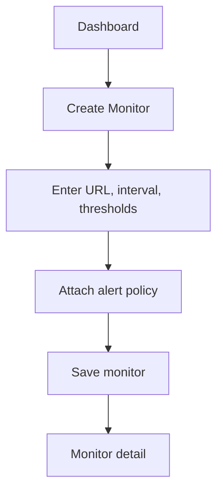
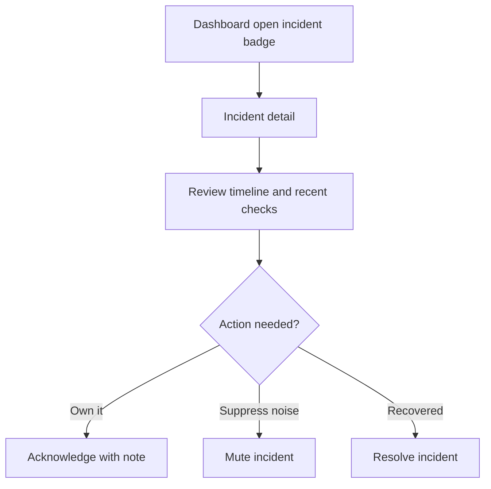
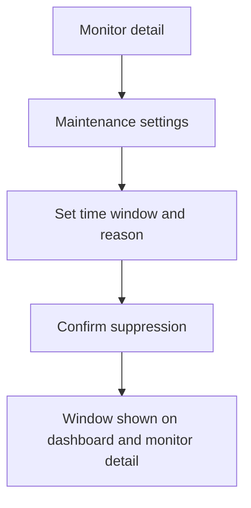

# UX Specification -- site-monitor

## User Flows

### Create First Monitor

### Triage Incident

### Planned Maintenance

## Key Screens

### Dashboard

**Purpose:** Give operators immediate visibility into overall service health, open incidents, and monitor state.
**Entry points:** Default authenticated route, logo navigation, incident action completion redirect.
**Key elements:**
- Status summary tiles
- Filterable monitor table
- Open incident list
- Quick actions for new monitor and saved filters

**States:**
- **Loading:** Skeleton tiles and table rows preserve layout.
- **Empty:** Zero-state explains that no monitors exist yet and offers a primary create action.
- **Error:** Full-width error panel with retry and latest known timestamp.
- **Populated:** Summary tiles, monitor rows, and open incidents render together with sticky filters.

**Accessibility notes:**
- Dashboard filters and row actions must be fully keyboard reachable.
- Status color is always paired with text labels and icon shape.
- Live incident count changes should use polite announcements, not interruptive focus shifts.

**Performance notes:**
- Initial dashboard payload should include only summary, first page of rows, and open incidents.
- Filters should update table content without full page reload and should remain responsive on low-end mobile devices.

**Wireframe:**

  

    <b>site-monitor</b>
    Dashboard | Incidents | Monitors
  

  

    

      
Healthy 42

      
Degraded 3

      
Open incidents 2

      
Paused 5

    

    
Filters: environment | status | tag | incident state

    

      
Monitor table with status, latency, last check, next run

      
Open incidents with age, severity, assignee, quick open

    

  

Mobile wireframe (375px+):

  

    <b>site-monitor</b>
    Menu
  

  

    
Healthy 42

    
Open incidents 2

    
Compact filters

    
Incident cards

    
Monitor cards

  

### Monitor Detail and Edit

**Purpose:** Show a single monitor's configuration, recent behavior, and change surfaces.
**Entry points:** Dashboard row click, post-create redirect, incident detail backlink.
**Key elements:**
- Header with current state and last check
- Configuration form
- Alert policy summary
- Recent check history chart and table

**States:**
- **Loading:** Preserve header and panel dimensions with skeleton blocks.
- **Empty:** Only relevant for a newly created monitor with no checks yet; explain when first run will occur.
- **Error:** Inline error for failed data fetch or failed save, with retry and unsaved-change retention.
- **Populated:** Form, status metadata, and history render in a two-column desktop layout.

**Accessibility notes:**
- Form validation errors must be associated to their fields and summarized at top on submit.
- Pause, resume, and archive actions require button text that describes the current effect.
- History chart needs a tabular alternative.

**Performance notes:**
- Recent check history can load progressively after the core monitor record.
- Save actions should show optimistic button state but not fake incident or check history.

**Wireframe:**

  

    <b>Monitor Detail</b> | checkout.example.com | Degraded
  

  

    
Config form: URL, method, interval, timeout, keyword, tags

    

      
Status summary and next run

      
Alert policy and maintenance window

    

    
Recent check chart and table

  

Mobile wireframe (375px+):

  

    <b>Monitor Detail</b>
  

  

    
Status summary

    
Config form stack

    
Alert policy and maintenance

    
Recent checks list

  

### Incident Detail

**Purpose:** Let the on-call responder understand what failed, what has happened since, and what action to take.
**Entry points:** Dashboard incident list, incident deep link from notification, monitor detail incident history.
**Key elements:**
- Incident header with state, age, and action buttons
- Timeline of incident and operator events
- Recent failed and recovered checks
- Notification delivery history

**States:**
- **Loading:** Header and timeline skeletons keep action area stable.
- **Empty:** Not applicable once an incident exists; if the record was deleted, show not-found guidance.
- **Error:** Inline error with retry and fallback link to dashboard.
- **Populated:** Header, evidence panels, and timeline render with sticky action controls on desktop.

**Accessibility notes:**
- Action buttons need explicit labels such as "Acknowledge incident" and "Mute alerts for this incident".
- The timeline order must be readable in source order for screen readers.
- Delivery status chips require text equivalents, not color only.

**Performance notes:**
- Incident evidence can paginate older timeline events after the first screen.
- Actions should return quickly and append events without forcing a full refetch where possible.

**Wireframe:**

  

    <b>Incident INC-204</b>
    Acknowledge | Mute | Resolve
  

  

    
Timeline: opened, notifications sent, acknowledged, recovered

    

      
Incident summary and latest check evidence

      
Delivery history

    

  

Mobile wireframe (375px+):

  

    <b>Incident INC-204</b>
  

  

    
Action buttons stack

    
Summary and latest check

    
Timeline list

    
Delivery history

  

